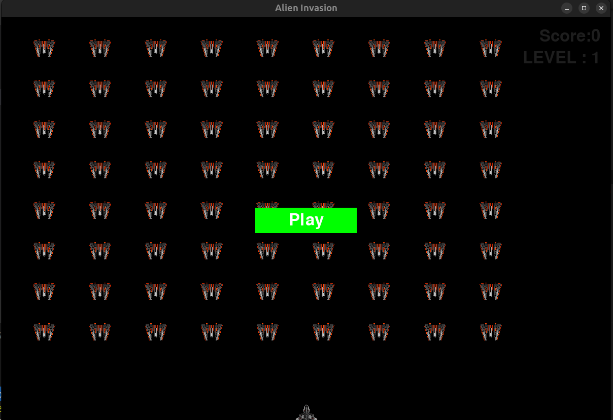

# Alien Invasion
Alien invasion is a game based on old retro games 

## Descriptions
Just a simple game created as a means to explore and learn Python and Pygame.

## Installation
1. Step 1
``pip install -r requirements.txt
``

2. Step 2
``python -u alien_invasion.py``

3. Step 3
** Enjoy the games** 

##Games settings
> 3 Tries try to get best score
10 Bullets
Increasing difficulty by 1.5
Increasing score by ``1.5*score``
Setting can be changed form ``settings.py``

